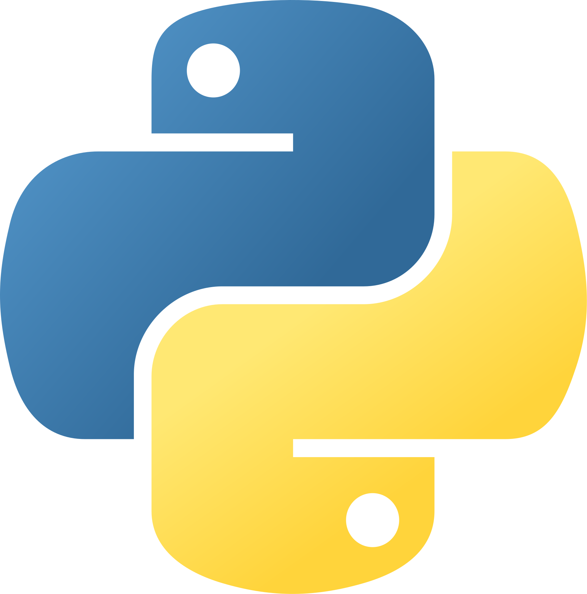

# 😄 Welcome!

---
## 🇧🇷 Who am I
I'm Diego, a Computer Science student at UFC (Universidade Federal do Ceará), and currently working at [LSBD](https://lsbd.ufc.br/), in Fortaleza - Brazil.

## 💻 What do I code with?

  <code></code>
  <code></code>
  <code></code>
  <code></code>
  <code></code>
  <code></code>
  <code></code>
  <code></code>
  <code></code>
  <code></code>
  <code></code>
  <code></code>
  <code></code>
 

## 💜 What do I love?
- 🧠 Machine Learning
- 🔓 Open Source
- 🤖 Automation

## 📈 How about some stats?

|  |  |
| ------------- | ------------- |

## 🧠 Machine Learning Models
I'm taking a course on Machine Learning on Udemy, and here are the current models that I've developed:
- [Simple Linear Regression](https://github.com/nikrs14/simple-linear-regression.git)
- [Multiple Linear Regression](https://github.com/nikrs14/multiple-linear-regression.git)
- [Polynomial Regression](https://github.com/nikrs14/polynomial-regression.git)
- [Support Vector Regression](https://github.com/nikrs14/support-vector-regression.git)
- [Decision Tree Regression](https://github.com/nikrs14/decision-tree-regression.git)
- [Random Forest Regression](https://github.com/nikrs14/random-forest-regression.git)
- - [**All Regression Models** Resume](https://github.com/nikrs14/regression-resume.git)
- [Logistic Regression](https://github.com/nikrs14/logistic-regression.git)

