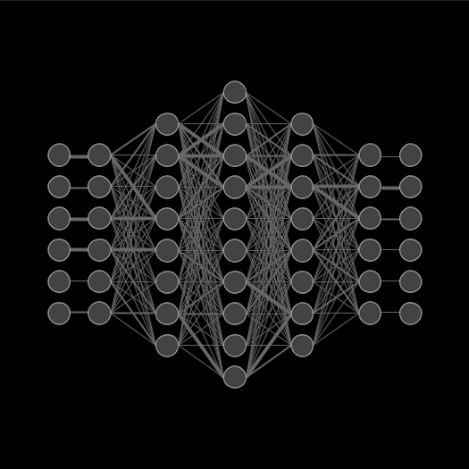
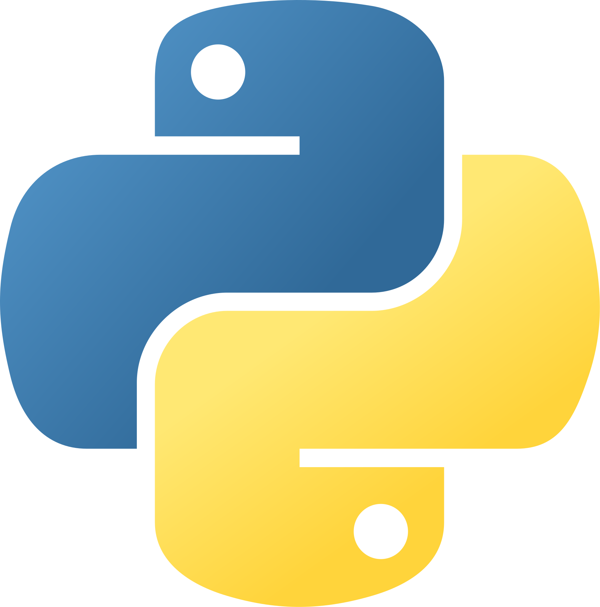
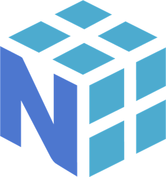
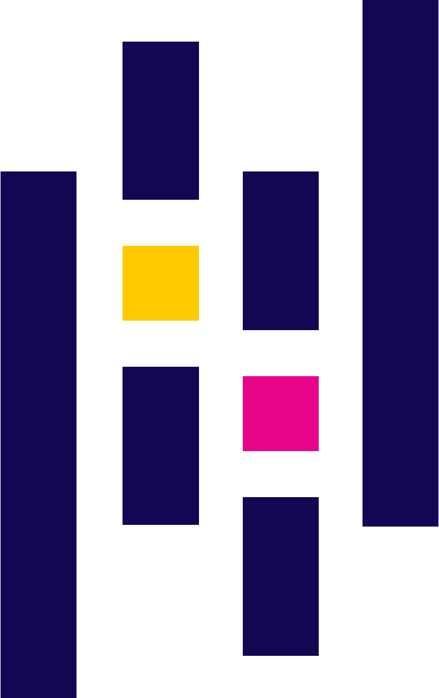
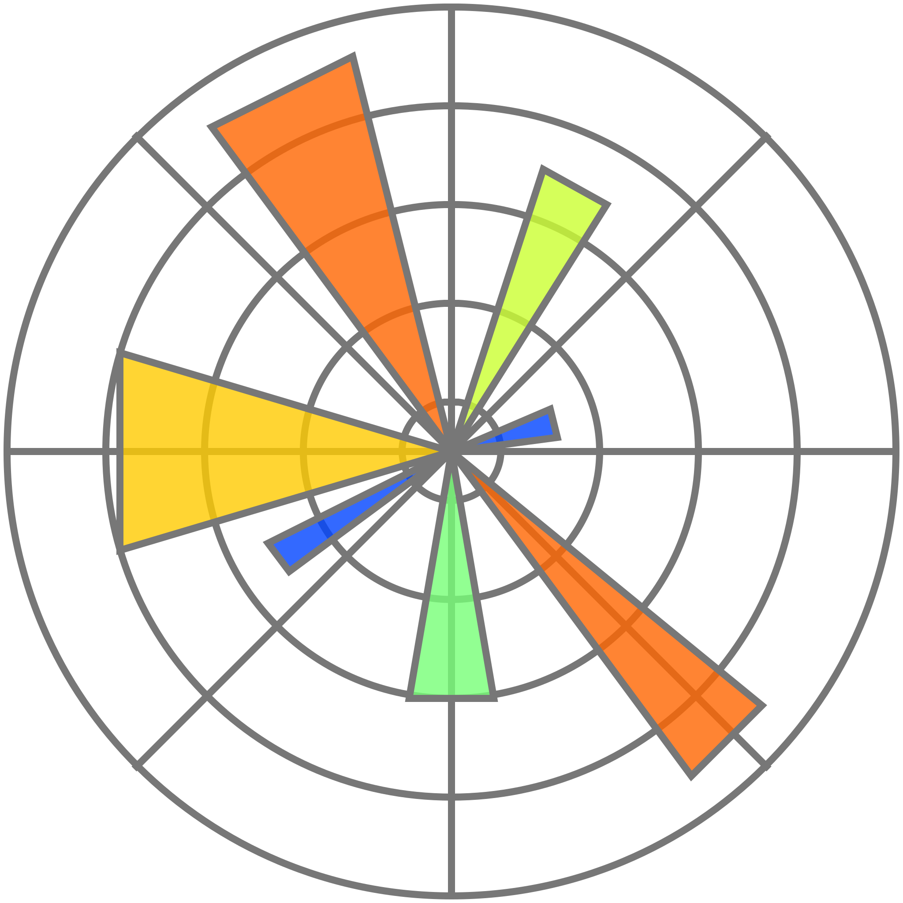
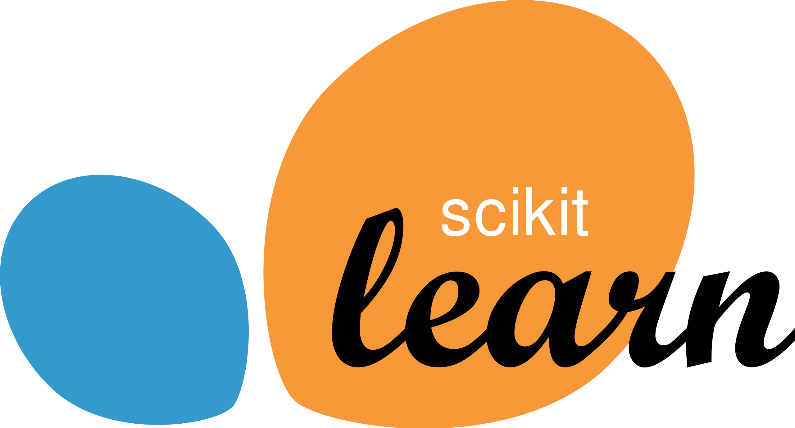
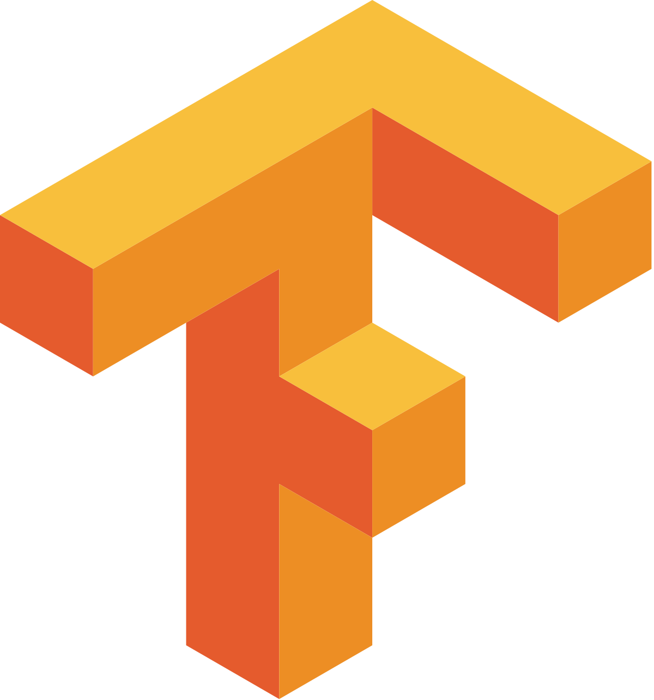
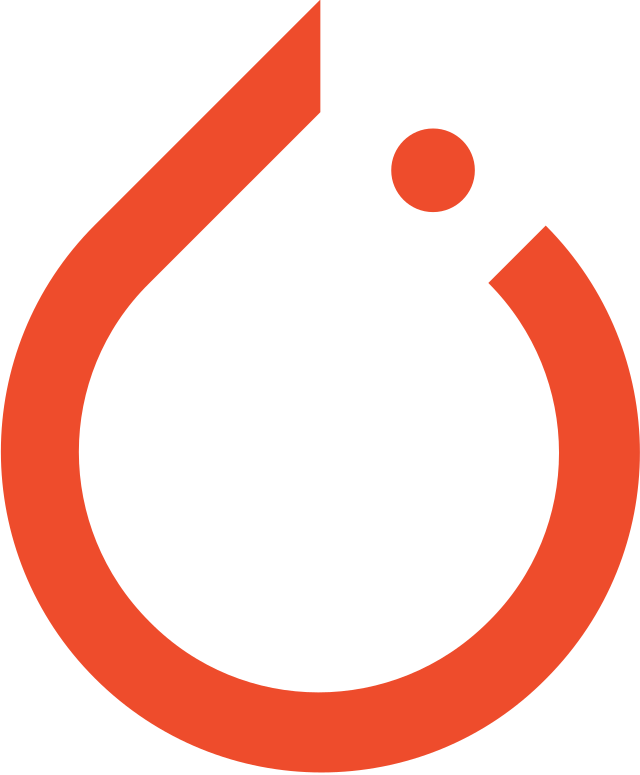
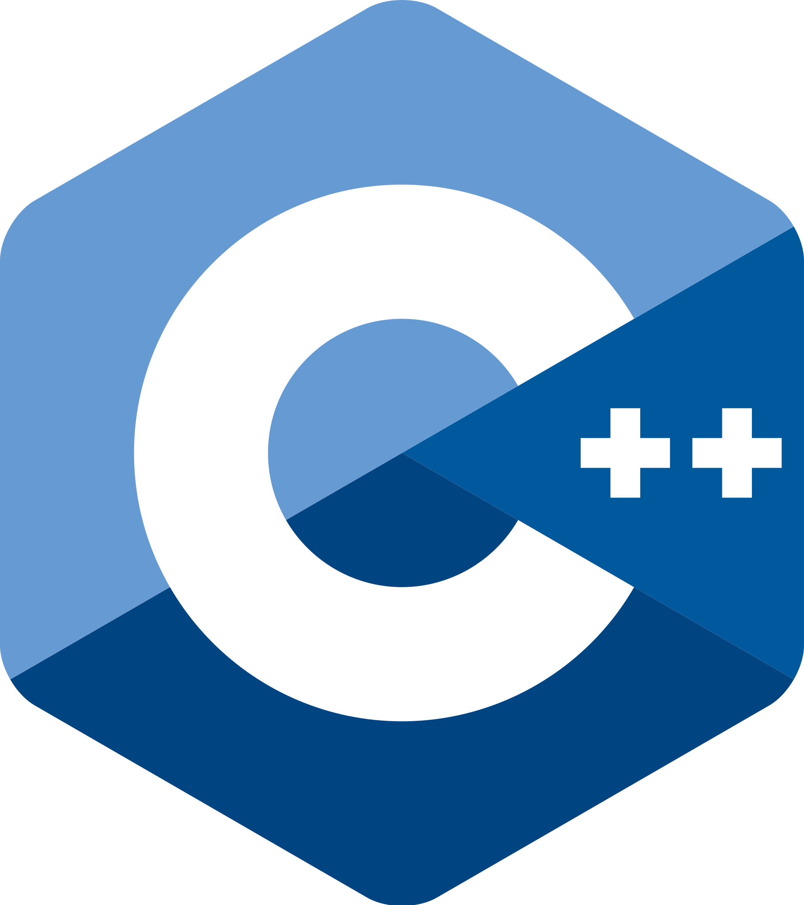
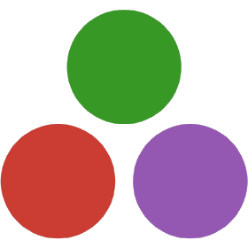

# 😄 Welcome!

---
## 🇧🇷 Who am I
I'm Diego, a Computer Science student at UFC (Universidade Federal do Ceará).

## 💻 What do I code with?

  <code></code>
  <code></code>
  <code></code>
  <code></code>
  <code></code>
  <code></code>
  <code></code>
  <code></code>
  <code></code>
  <code></code>
  <code></code>
  <code></code>
  <code></code>
  <code></code>
 

## 💜 What do I love?
- 📊 Data Science
- 🧠 Machine Learning
- 🔓 Open Source
- 👾 Game Development (sometimes :v)

## 📈 How about some stats?

|  |  | 
| ------------- | ------------- |

